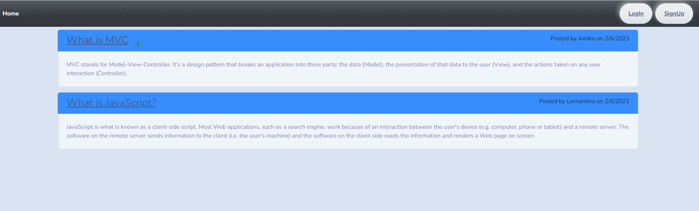

# Tech Blog
[](https://shields.io)

## Description

A CMS-style blog site similar to a Wordpress site, where developers can publish their blog posts and comment on other developers’ posts as well. This apps follow MVC paradigm in its architectural structure, using Handlebars.js as the templating language, Sequelize as the ORM, and the express-session npm package for authentication.


## Table of Contents
* [Installation](#installation)
* [Usage](#usage)
* [Documentation](#documentation)
* [Questions](#questions)

## Installation

To install necessary dependencies, run the following command:

```
npm i
```
* This application use the following dependencies
    * Express
    * Express-handlebars
    * Express-session
    * MySQL2 
    * Sequelize
    * Dotenv
    * Bcrypt
    * Connect-session-sequelize

## Usage

Clone the repo, navigate to the root folder, run the following commands from the CLI:

Seed DB;   
`npm run seed`     

Start Server;     
`npm start server`    

## Documentation
Deployed application can be found [here](https://intense-journey-34063.herokuapp.com/).
The following picture is the screenshot of the application: 

 


## Questions
If you have any questions about this projects, please contact me at test@test.com or more projects on [Github](https://github.com/begirlz)